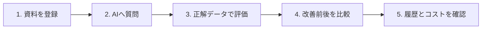
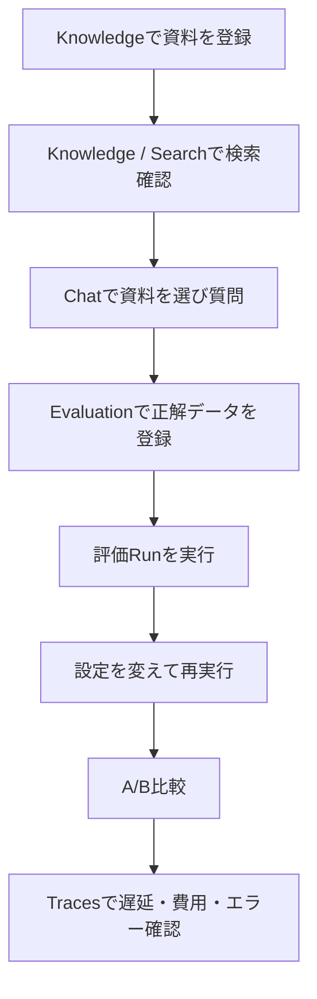

# ForgeAI 導入・利用マニュアル

> 対象: ForgeAI v0.1（Alpha）  
> 更新日: 2026-09-08  
> リポジトリ: <https://github.com/sibukixxx/rag-poc>

## 1. ForgeAIとは

ForgeAIは、社内資料や業務文書を登録し、その内容を根拠にAIへ質問できる**自ホスト型RAG品質評価サービス**です。

単に「PDFへ質問する」だけではなく、検索結果が正しかったか、変更後に品質が改善したかを数値と実行履歴で確認できます。データは自分のPCやサーバー内のSQLiteとファイル領域に保存されます。



### できること

| サービス | 画面上の表示 | 用途 | 主な成果 |
|---|---|---|---|
| 💬 AI回答 | Chat | 通常チャット、または登録資料を根拠にしたRAG回答 | 引用付き回答、トークン数、APIコスト |
| 📚 資料管理 | Knowledge | ナレッジベース作成、文書登録、検索テスト | 検索可能な文書とチャンク |
| 📝 回答ルール | Prompts | AIへの指示を版管理して切り替える | プロンプト履歴、差分、有効版 |
| 🔎 実行履歴 | Traces | 処理時間、トークン、コスト、エラーを調査 | Traceと処理単位のSpan |
| 🎯 品質評価 | Evaluation | Golden Datasetで品質測定、2回の結果を比較 | Recall、Precision、MRR、Hit Rate、LLM Judge評価 |

### 現在の注意事項

- v0.1はAlpha版です。APIや設定形式が変わる可能性があります。
- 管理画面と`/api/v1`にはアプリ単体のユーザー認証がありません。インターネット公開時はCloudflare Accessなどで必ず保護してください。
- OpenAI互換APIを使う場合、チャット、埋め込み、Rerank、LLM Judgeでプロバイダー側の利用料金が発生します。
- SQLiteとアップロードファイルのバックアップは利用者側で行います。

## 2. まず試すための推奨構成

初回確認は、次の構成が最も簡単です。

| 項目 | 推奨 |
|---|---|
| 実行場所 | 自分のPC |
| 起動方法 | Goでビルドして直接起動 |
| LLM・Embedding | OpenAI互換API |
| 公開範囲 | `localhost`のみ |
| 確認用データ | 同梱の`examples/docs`と`examples/golden-dataset.json` |

必要なもの:

- Git
- Go 1.25以上
- OpenAI互換APIのキー
- ブラウザ
- Dockerは任意。外部公開や常時運用では利用を推奨

## 3. ローカルへの導入方法

### 3.1 リポジトリを取得する

```bash
git clone https://github.com/sibukixxx/rag-poc.git
cd rag-poc
```

### 3.2 バイナリを作る

```bash
make build
```

成功すると、`dist/forgeai`が作成されます。React画面はバイナリへ埋め込まれているため、通常利用にNode.jsは不要です。

### 3.3 初期化する

```bash
./dist/forgeai init
```

このコマンドは次を行います。

1. カレントディレクトリへ`forgeai.yaml`を作成する
2. 秘密情報の暗号化に使う`FORGEAI_MASTER_KEY`を表示する

表示されたマスターキーは再生成せず、安全なパスワード管理ツールなどへ保存してください。キーを失うと、ForgeAI内へ暗号化保存したAPIキーを復号できません。

### 3.4 APIキーを設定する

最初は環境変数を使うのが簡単です。

```bash
export FORGEAI_MASTER_KEY='initで表示された値'
export FORGEAI_OPENAI_API_KEY='利用するAPIキー'
```

APIキーをSQLiteへ暗号化保存する場合は、マスターキーを設定したうえで次を実行します。

```bash
printf '%s' "$FORGEAI_OPENAI_API_KEY" | ./dist/forgeai secret set openai
```

環境変数と暗号化保存の両方に同じキーがある場合は、環境変数が優先されます。

### 3.5 設定を確認する

```bash
./dist/forgeai doctor
```

次の項目が`OK`になることを確認します。

- Config
- Filesystem
- Database
- Master key
- LLM alias `cheap` / `normal` / `judge`
- Embedding model

`doctor`はAPIへテスト通信せず、設定とキーの解決状態を確認します。`OK`でも、無効なキーやプロバイダー障害は実際の呼び出し時にエラーになります。

### 3.6 サーバーを起動する

```bash
./dist/forgeai serve
```

ブラウザで <http://localhost:8080> を開きます。別の設定ファイルを使う場合は、各コマンドへ`-config`を付けます。

```bash
./dist/forgeai serve -config ./forgeai.yaml
```

### 3.7 停止する

サーバーを起動したターミナルで`Ctrl+C`を押します。

## 4. Dockerで導入する方法

### 4.1 ローカルだけで使う

マスターキーを先に生成します。Goがない場合もDockerで生成できます。

```bash
docker build -t forgeai:local .
docker run --rm forgeai:local init -config /tmp/forgeai.yaml
```

表示されたキーとAPIキーを環境変数へ設定し、永続ボリューム付きで起動します。

```bash
export FORGEAI_MASTER_KEY='表示された値'
export FORGEAI_OPENAI_API_KEY='利用するAPIキー'

docker run -d \
  --name forgeai \
  --restart unless-stopped \
  -p 127.0.0.1:8080:8080 \
  -e FORGEAI_MASTER_KEY \
  -e FORGEAI_OPENAI_API_KEY \
  -v forgeai-data:/data \
  forgeai:local serve
```

確認と停止:

```bash
curl http://localhost:8080/api/v1/health
docker logs -f forgeai
docker stop forgeai
```

### 4.2 Cloudflare Tunnelで外部公開する

リポジトリの`.env.example`をコピーします。

```bash
cp .env.example .env
```

`.env`へ次を設定します。

```dotenv
FORGEAI_MASTER_KEY=initで生成した値
FORGEAI_OPENAI_API_KEY=利用するAPIキー
TUNNEL_TOKEN=Cloudflareで発行したトークン
FORGEAI_VERSION=dev
```

起動:

```bash
docker compose up -d --build
docker compose logs -f cloudflared
```

Cloudflare側ではPublic Hostnameの接続先を`http://forgeai:8080`にします。また、Cloudflare Accessで許可するメールアドレスを限定してください。

詳細は[Cloudflareデプロイ手順](deploy-cloudflare.md)を参照してください。

## 5. 初回利用の全体手順

初回は次の順番で操作すると、ForgeAIの価値を一通り確認できます。



## 6. 画面の利用方法

### 6.1 📚 資料管理（Knowledge）

#### ナレッジベースを作る

1. 上部の「資料管理」を開く
2. `New knowledge base name`へ、例として`社内FAQ`と入力する
3. `Create`を押す
4. 左側の選択欄に作成した名前が表示されることを確認する

ナレッジベースは、検索対象の資料を目的別にまとめる箱です。「社内規程」「製品マニュアル」「顧客A資料」のように分けます。

#### 文書を登録する

1. 対象ナレッジベースを選ぶ
2. `Documents`を選ぶ
3. `Upload document`を押す
4. PDF、TXT、MD、HTML、CSV、JSONのいずれかを選ぶ
5. Statusが`Ready`になり、Chunksが1以上になることを確認する

同じ内容を再登録した場合は、既存の埋め込みを再利用して余計なAPI利用を抑えます。

#### 検索品質を目視確認する

1. `Search`を開く
2. 登録資料に関する質問を入力する
3. 必要に応じて`Rerank`を有効にする
4. `Search`を押す
5. ファイル名、ページ、score、取得本文を確認する

まずRerankなしで確認し、その後Rerankありと比較すると効果が分かります。Rerankは追加のLLM呼び出しを伴うため、品質だけでなくTracesの費用と遅延も確認してください。

### 6.2 💬 AI回答（Chat）

#### 通常チャット

1. 上部の「AI回答」を開く
2. aliasを選ぶ。通常は`normal`を使う
3. ナレッジベースを`No knowledge base`のままにする
4. 質問を入力して送信する

#### 登録資料を根拠に回答させる

1. aliasは`normal`を選ぶ
2. 2つ目の選択欄でナレッジベースを選ぶ
3. 登録資料に関する質問を入力する
4. 回答中の`[1]`などの引用を開く
5. 引用元のファイル名、ページ、本文を確認する

ナレッジベースを選択すると、通常チャットではなくRAG回答になります。該当資料が見つからない場合は`No matching context found`と表示されます。

#### aliasの使い分け

| alias | 想定用途 |
|---|---|
| `cheap` | 低コスト処理、Rerank |
| `normal` | 通常のチャットとRAG回答 |
| `judge` | Evaluationの回答品質採点 |

実際に使うモデルは`forgeai.yaml`の`llm.aliases`で変更できます。

### 6.3 📝 回答ルール（Prompts）

1. 上部の「回答ルール」を開く
2. 対象プロンプトを選ぶ
3. 新しい指示内容を入力する
4. `Save as new version`で新しい版として保存する
5. `Diff vs previous`で直前の版との差分を確認する
6. 問題なければ`Activate`で有効化する

RAG回答へ使う標準プロンプトは`rag_system`です。評価用の採点基準は`rag_judge`です。有効版を切り替えると再デプロイせず、次の呼び出しから反映されます。

安全な改善手順は次のとおりです。

1. 変更前にEvaluationを実行する
2. 新しいプロンプト版を保存・有効化する
3. 同じGolden Datasetで再度Evaluationを実行する
4. 変更前をA、変更後をBとして比較する
5. 改善が確認できた場合だけ新しい版を使い続ける

### 6.4 🎯 品質評価（Evaluation）

Golden Datasetは、質問と正解資料を組にした**品質測定用の正解データ**です。AIモデルを学習させるデータではありません。

#### Golden Datasetを作る

画面上で対象ナレッジベースを選び、データセット名を入力して`Create`します。次にJSONまたはCSVをインポートします。

JSONの最小例:

```json
{
  "cases": [
    {
      "query": "返品はいつまで可能ですか？",
      "expected_filenames": ["returns.md"],
      "expected_answer": "商品到着後30日以内であれば返品できます。"
    }
  ]
}
```

| フィールド | 必須 | 意味 |
|---|---:|---|
| `query` | 必須 | 利用者が入力する質問 |
| `expected_filenames` | 必須 | 検索で取得されるべきファイル名の配列 |
| `expected_answer` | 任意 | LLM Judgeが回答品質を評価するときの正解例 |

#### 評価を実行する

1. データセットを選ぶ
2. `top_k`を選ぶ。最初は`10`を推奨
3. 検索順位をLLMで並べ替える場合は`Rerank`を有効にする
4. 回答自体も採点する場合は`LLM Judge`を有効にする
5. Evaluationを開始する
6. `Pending`→`Running`→`Done`になるまで待つ
7. Runを開き、集計値と失敗ケースを確認する

#### 指標の読み方

| 指標 | 何を示すか | 良い状態 |
|---|---|---|
| Recall@K | 正解資料を上位K件内でどれだけ回収できたか | 1.0に近い |
| Precision@K | 上位K件のうち正解資料が占める割合 | 1.0に近い |
| MRR | 最初の正解資料がどれだけ上位に出たか | 1.0に近い |
| Hit Rate | 質問ごとに正解資料を1件以上取得できた割合 | 1.0に近い |
| Correctness | 回答が正解内容と一致しているか | 1.0に近い |
| Groundedness | 回答が取得資料に基づいているか | 1.0に近い |
| Relevance | 回答が質問へ直接答えているか | 1.0に近い |

#### 2回の結果を比較する

1. 同じデータセットで設定変更前と変更後のRunを完了させる
2. 変更前のRunを`A`として選ぶ
3. 変更後のRunを`B`として選ぶ
4. 比較画面でWinner、指標差分、改善・悪化ケースを確認する
5. `Markdown`エクスポートで報告書を保存する

比較する2回は、同じGolden Datasetを使ってください。異なる質問群では改善効果を正しく比較できません。

### 6.5 🔎 実行履歴（Traces）

1. 上部の「実行履歴」を開く
2. `Refresh`を押す
3. 調べたい行を選ぶ
4. 下部のSpan一覧で処理単位を確認する

確認できる項目:

- 処理名と成功・失敗
- 全体の処理時間
- LLMの入力・出力トークン数
- 推定APIコスト
- embed、retrieve、rerank、judgeなどの処理単位
- エラー内容

「回答が遅い」「Rerankで費用が増えた」「特定の質問だけ失敗する」ときの調査に使います。

## 7. 同梱サンプルで一連の動作を確認する

APIキーを設定してビルドした後、次を実行します。

```bash
# 1. サンプル文書をdemoナレッジベースへ登録
./dist/forgeai ingest -kb demo ./examples/docs

# 2. 50問のGolden Datasetを登録
./dist/forgeai eval import -kb demo demo-golden ./examples/golden-dataset.json

# 3. 通常検索を評価
./dist/forgeai eval run demo-golden

# 4. RerankとLLM Judgeを有効にして再評価
./dist/forgeai eval run -rerank -judge demo-golden

# 5. Run IDを確認
./dist/forgeai eval list demo-golden

# 6. 2回の結果を比較し、顧客向けMarkdownを出力
./dist/forgeai eval compare -o report.md <変更前Run-ID> <変更後Run-ID>
```

ブラウザ画面を使う場合は、別のターミナルで次を起動します。

```bash
./dist/forgeai serve
```

その後、<http://localhost:8080>の「AI回答」で`demo`を選び、次のような質問を試します。

- 返品はいつまで可能ですか？
- 送料無料になる条件はありますか？
- 電話サポートの受付時間は？

## 8. 主なCLIコマンド

| 目的 | コマンド |
|---|---|
| 初期化 | `./dist/forgeai init` |
| 設定診断 | `./dist/forgeai doctor` |
| 起動 | `./dist/forgeai serve` |
| APIキー保存 | `./dist/forgeai secret set openai` |
| APIキー削除 | `./dist/forgeai secret delete openai` |
| 文書一括登録 | `./dist/forgeai ingest -kb <slug> <directory>` |
| 正解データ登録 | `./dist/forgeai eval import -kb <slug> <dataset> <file>` |
| 検索評価 | `./dist/forgeai eval run <dataset>` |
| 回答品質も評価 | `./dist/forgeai eval run -judge <dataset>` |
| Run一覧 | `./dist/forgeai eval list <dataset>` |
| 比較 | `./dist/forgeai eval compare <run-a> <run-b>` |
| 比較レポート保存 | `./dist/forgeai eval compare -o report.md <run-a> <run-b>` |

フラグはサブコマンド名の後、データセット名などの位置引数より前に置きます。

## 9. 設定ファイル

`forgeai init`が生成する最小設定:

```yaml
server:
  port: 8080
database:
  type: sqlite
  path: ./data/forgeai.db
storage:
  type: filesystem
  path: ./data/files
security:
  encryption_key_env: FORGEAI_MASTER_KEY
```

OpenAI以外のOpenAI互換サービスを使う場合は、`llm`と`embedding`を設定します。`base_url`には`/chat/completions`ではなくAPIルートを指定します。

```yaml
llm:
  providers:
    default:
      type: openai_compatible
      base_url: https://api.openai.com/v1
      api_key_env: FORGEAI_OPENAI_API_KEY
      api_key_secret: openai
  aliases:
    cheap:  { provider: default, model: gpt-4o-mini }
    normal: { provider: default, model: gpt-4o-mini }
    judge:  { provider: default, model: gpt-4o-mini }
  pricing:
    gpt-4o-mini: { input_per_1m: 0.15, output_per_1m: 0.60 }
  currency:
    display: USD
    usd_rate: 1.0

embedding:
  provider:
    type: openai_compatible
    base_url: https://api.openai.com/v1
    api_key_env: FORGEAI_OPENAI_API_KEY
  model: text-embedding-3-small
  dimensions: 1536
```

環境変数で上書きできる設定:

| 環境変数 | 用途 |
|---|---|
| `FORGEAI_MASTER_KEY` | 暗号化保存した秘密情報の復号 |
| `FORGEAI_OPENAI_API_KEY` | 標準設定のLLM・Embedding APIキー |
| `FORGEAI_PORT` | 待受ポート |
| `FORGEAI_DB_PATH` | SQLiteファイルの保存先 |
| `FORGEAI_STORAGE_PATH` | アップロードファイルの保存先 |

Embeddingモデルや次元数を変えた場合は、既存文書を再登録してください。異なるモデルのベクトルを混在させると正しい検索比較になりません。

## 10. バックアップ・更新・復元

### Goで直接起動している場合

サーバーを停止し、`data`ディレクトリ全体をバックアップします。

```bash
tar czf forgeai-data-$(date +%Y%m%d).tgz data
```

復元は、ForgeAIを停止した状態でバックアップ内の`data`を元の場所へ戻します。`FORGEAI_MASTER_KEY`も別途安全に保管してください。

### Dockerの場合

```bash
docker run --rm \
  -v forgeai-data:/data \
  -v "$PWD":/backup \
  alpine tar czf /backup/forgeai-data-$(date +%Y%m%d).tgz -C /data .
```

### 更新

Goで直接起動:

```bash
git pull
make build
./dist/forgeai serve
```

Docker Compose:

```bash
git pull
docker compose up -d --build
```

更新前にデータをバックアップしてください。起動時にSQLite migrationが自動適用されます。

## 11. トラブルシューティング

### `doctor`でMaster keyがFAILになる

```bash
export FORGEAI_MASTER_KEY='initで表示された値'
./dist/forgeai doctor
```

新しいキーを適当に設定すると、以前保存したAPIキーを復号できません。必ず初期化時のキーを使います。

### LLM aliasまたはEmbedding modelがFAILになる

```bash
export FORGEAI_OPENAI_API_KEY='利用するAPIキー'
./dist/forgeai doctor
```

独自プロバイダーの場合は、`forgeai.yaml`の`base_url`、モデル名、キーを格納する環境変数名を確認します。

### 文書がFailedになる

- 対応形式か確認する
- ファイルが壊れていないか確認する
- PDFが画像だけの場合、v0.1にはOCRがないためTXTまたはMDへ変換する
- Tracesとサーバーログでエラー内容を確認する

### RAG回答に引用が出ない

- Chatでナレッジベースを選択したか確認する
- KnowledgeのDocumentsで文書が`Ready`か確認する
- KnowledgeのSearchで同じ質問を検索し、正解資料が取得されるか確認する
- 質問に資料中の固有語を加える
- Rerankあり・なしを比較する

### 評価値が低い

まず失敗ケースを開き、次の順番で切り分けます。

1. `expected_filenames`が実際の登録ファイル名と完全一致しているか
2. 正解情報が登録資料に本当に含まれているか
3. Searchで正解資料が上位K件に入るか
4. `top_k`を増やすとRecallが改善するか
5. RerankでMRRが改善するか
6. 回答ルール変更でCorrectness・Groundednessが改善するか

### ポート8080が使用中になる

```bash
FORGEAI_PORT=8081 ./dist/forgeai serve
```

ブラウザでは<http://localhost:8081>を開きます。

### Docker ComposeがTUNNEL_TOKENを要求する

`docker-compose.yml`はCloudflare Tunnelを含む公開用構成です。ローカルだけで試す場合は「4.1 ローカルだけで使う」の`docker run`を使ってください。

## 12. 本番利用前チェックリスト

- [ ] `forgeai doctor`がすべてOK
- [ ] Cloudflare Accessなどで管理画面と`/api/v1`を保護した
- [ ] `FORGEAI_MASTER_KEY`を安全な場所へ保存した
- [ ] APIキーをGitへコミットしていない
- [ ] SQLiteとアップロードファイルの定期バックアップを設定した
- [ ] Golden Datasetを実データから作成した
- [ ] プロンプトや検索設定の変更前後をEvaluationで比較した
- [ ] TracesでAPIコストと遅延を確認した
- [ ] Alpha版であることを利用者へ共有した

## 13. 関連ドキュメント

- [README](../README.md)
- [v0.1仕様](V0.1_SPEC.md)
- [評価Evidence仕様](EVALUATION.md)
- [開発ロードマップ](ROADMAP.md)
- [Cloudflareデプロイ手順](deploy-cloudflare.md)
- [サンプルデータ](../examples/README.md)

